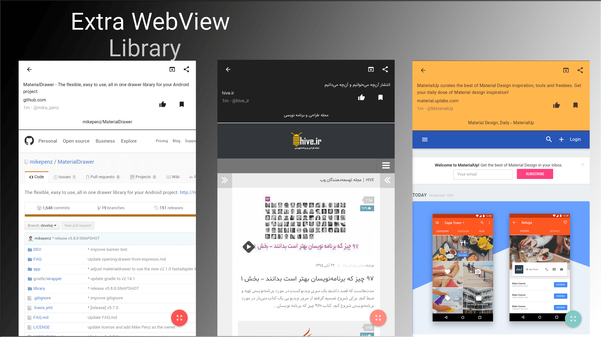
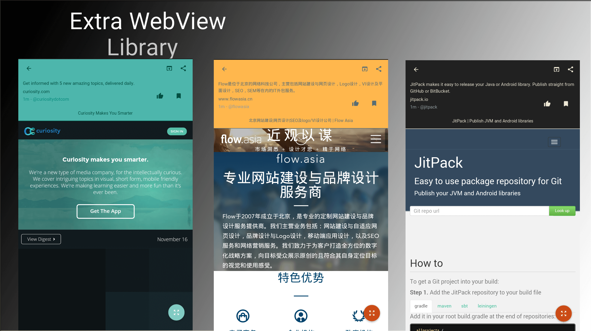
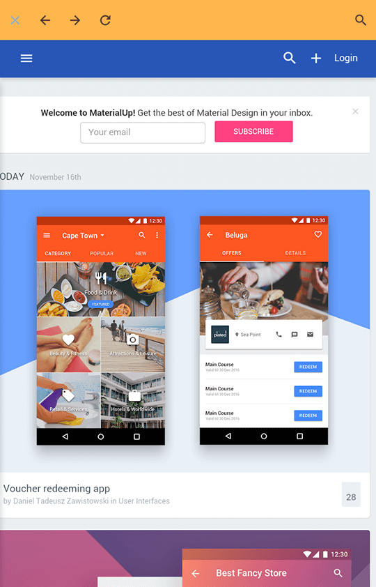

# Extra WebView Library
##the flexible and easy to use WebView library with beautiful themes.

###A quick overview
- compatible with **API Level 17**
- **RTL** support
- **multi theme** support
- with **full screen** mode
- share URL **easy way**
- search in page support
- with **Bookmark** and **Vote** icon that handle with **EventBus** library

#Preview
##Demo
You can download the latest demo APK from here: https://github.com/bkhezry/ExtraWebView/blob/master/assets/DemoExtraWebView-last.apk

##Screenshots


###full screen mode


#Setup
##1. Provide the gradle dependency
Add it in your root build.gradle at the end of repositories:
```gradle
allprojects {
	repositories {
		...
		maven { url "https://jitpack.io" }
	}
}
```
Add the dependency:
```gradle
dependencies {
	compile 'com.github.bkhezry:ExtraWebView:1.2.0'
}
```

##2. Add your code
add ItemActivity to AndroidManifest.xml
```xml
 <activity
            android:name="com.github.bkhezry.extrawebview.ItemActivity"
            android:screenOrientation="portrait" />
```
```java
DataModel dataModel = new DataModelBuilder()
                .withId(id)
                .withType("blog")
                .withBy(authorName)
                .withTime(timestamp)
                .withUrl(url)
                .withDescription(description)
                .withBookmark(true)
                .withViewed(true)
                .withRank(0)
                .withVoted(true)
                .withPageTitle(title)
                .build();
new ExtraWebViewCreator()
	.withContext(MainActivity.this)
	.withBookmarkIcon(true)
	.withVoteIcon(true)
	.withCustomFont("fonts/IRANSansMobile.ttf")
	.withThemeName(themeName)
	.withDataModel(dataModel)
	.show();
```		
after that new activity start with WebView ui

## DataModel attributes

| Name | Type | Default | Description |
|:----:|:----:|:-------:|:-----------:|
|id|Long|@NonNull| unique id of post. use in bookmark and vote icon event handler |
|type|String|blog| type of post. use in future development |
|by|String|@NonNull| author name of post|
|time|Long|@NonNull| create time of post as timestamp format |
|url|String|@NonNull | url of post |
|description|String|@NonNull | description of post |
|bookmark|boolean|false| bookmark status of post |
|viewed|boolean|false| viewed status of post. use in future development |
|rank|integer |0 | rank of post by users. use in future development |
|voted|boolean|false | vote status of post |
|pageTitle|String|@NonNull | title of post |

## ExtraWebViewCreator attributes
| Name | Type | Default | Description |
|:----:|:----:|:-------:|:-----------:|
|context|Context|@NonNull| context of current activity |
|bookmarkIcon|boolean|false| show icon of bookmark when true |
|customFont|String|@Nullable| use calligraphy library to set custom font. path of font in assets folder|
|themeName|String|light| name of theme use in WebView ui |
|dataModel|DataModel|@NonNull | object of DataModel class |

List of theme name: `light`, `dark`, `sepia`, `green`, `solarized` and `solarized_dark`
[ThemePreference.java](https://github.com/bkhezry/ExtraWebView/blob/master/library/src/main/java/com/github/bkhezry/extrawebview/data/ThemePreference.java)
#Additional Setup
you can handle bookmark and vote icon click event.
add this code to onCreate method of activity:
```java
EventBus.getDefault().register(this);
```
after that subscribe method as listener:
```java
@Subscribe(threadMode = ThreadMode.MAIN)
public void doThis(IntentServiceResult intentServiceResult) {
	if (intentServiceResult.isChecked()) {

	} else {

	}
}
```
when each icon has been clicked, EventBus return object of IntentServiceResult.
## IntentServiceResult attributes
| Name | Type | value |
|:----:|:----:|:-------:|
|id|Long|current post id |
|typeEvent|String| BOOKMARK or VOTE|
|isChecked|boolean|status of icon. if true icon is checked |
#Credits

- Ha Duy Trung - [GitHub](https://github.com/hidroh)
	- A material-design Hacker News Android reader [Materialistic for Hacker News](https://github.com/hidroh/materialistic)

#Developed By

* Behrouz Khezry
 * [@bkhezry](https://twitter.com/bkhezry) 


#License

    Copyright 2016 Behrouz Khezry

    Licensed under the Apache License, Version 2.0 (the "License");
    you may not use this file except in compliance with the License.
    You may obtain a copy of the License at

       http://www.apache.org/licenses/LICENSE-2.0

    Unless required by applicable law or agreed to in writing, software
    distributed under the License is distributed on an "AS IS" BASIS,
    WITHOUT WARRANTIES OR CONDITIONS OF ANY KIND, either express or implied.
    See the License for the specific language governing permissions and
    limitations under the License.
